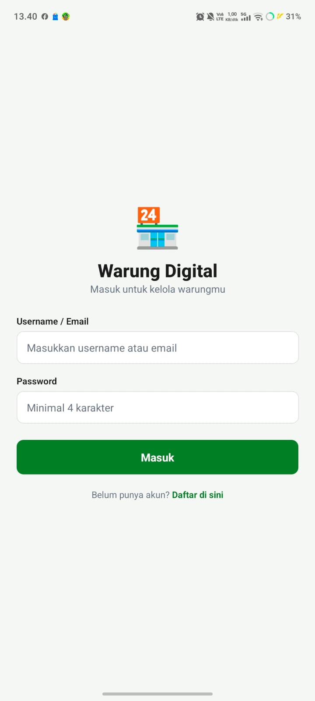
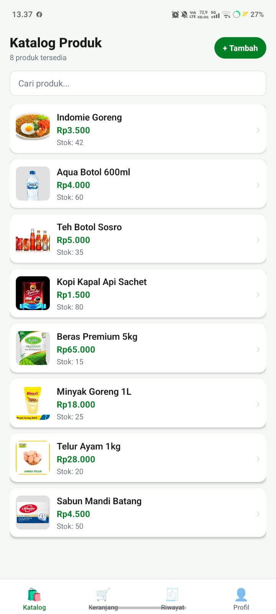
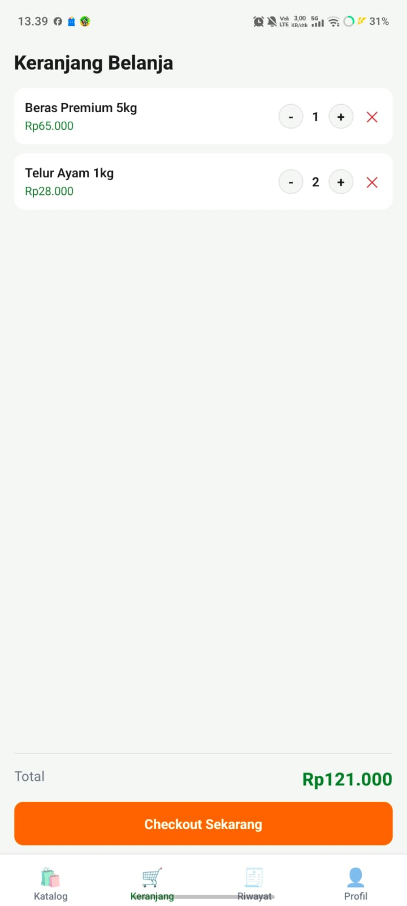

# [Nama Aplikasi] — [Domain: Warung Digital]


> [Warung Digital adalah aplikasi kasir & katalog produk untuk UMKM warung. Pemilik warung dapat mengelola katalog produk, mencatat penjualan lewat keranjang belanja, dan melihat riwayat transaksi — semua langsung dari HP.
]

---

## 📸 Screenshots

| Login Screen | Home Screen | Feature Screen |
|:---:|:---:|:---:|
|  |  |  |

---

## ✨ Fitur Utama

- [x] Login/Register dengan validasi form
- [x] Daftar [item domain] dengan FlatList
- [x] Detail [item] dengan navigasi Stack
- [x] [Fitur spesifik domain]
- [x] Foto via expo-image-picker / Lokasi via expo-location
- [x] Data persisten dengan AsyncStorage
- [x] Bottom Tab Navigation (4 tab)

---

## 🛠️ Tech Stack

| Layer | Teknologi |
|-------|-----------|
| Framework | React Native + Expo |
| Navigation | React Navigation v6 (Stack + Bottom Tab) |
| Storage | @react-native-async-storage/async-storage |
| Device | expo-image-picker / expo-location |
| Build | EAS Build (Expo Application Services) |

---

## 🚀 Cara Menjalankan

```bash
git clone https://github.com/username/nama-repo.git
cd nama-repo
npm install
npx expo start
```
Scan QR Code dengan Expo Go di HP.

---

## 📦 Download APK

[Download APK terbaru](https://expo.dev/artifacts/eas/Pvhaygb78EMJIW11hwtcbbdSWNTxvyK_9mEHG2ZHL5c.apk)

---

## 🌐 Expo Snack

[Buka di Expo Snack](https://snack.expo.dev/@maxwelltarigan2806/warungdigitaluas)

---

## 👤 Developer

**Maxwell Osse Tarigan** | 243303621224 | Semester 4 Pagi A
Universitas Prima Indonesia — Prodi Sistem Informasi
Mata Kuliah: Pemrograman Mobile (TI-MOBILE-01)
